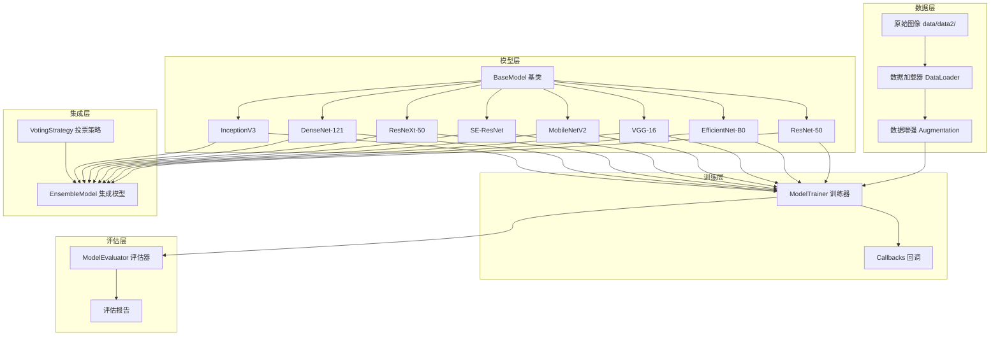

# Design Document: 糖尿病视网膜病变集成学习系统

## Overview

本设计文档描述了一个基于集成学习的糖尿病视网膜病变（DR）图像分类系统。系统整合8个预训练深度学习模型，通过投票策略实现5分类任务。

### 团队分工

| 成员 | 负责模型 | Git分支 |
|------|----------|---------|
| 组长 | ResNet-50, EfficientNet-B0 | `model-resnet-efficientnet` |
| 成员A | VGG-16, MobileNetV2 | `model-vgg-mobilenet` |
| 成员B | SE-ResNet, ResNeXt-50 | `model-seresnet-resnext` |
| 成员C | DenseNet-121, InceptionV3 | `model-densenet-inception` |

### 工作流程

```
Phase 1: 框架搭建 (组长)
    ↓
Phase 2: 各自训练模型 (全员并行)
    ↓
Phase 3: 模型评估 (全员)
    ↓
Phase 4: 集成学习 (组长)
    ↓
Phase 5: 系统测试与文档 (全员)
```

## Architecture

### 系统架构图



### 目录结构

```
diabetic-retinopathy/
├── data/                          # 数据目录（不上传Git）
│   └── data2/
│       ├── 0/ ~ 4/               # 原始图片（按类别）
│
├── src/                           # 源代码
│   ├── config.py                  # 全局配置
│   ├── preprocessing/             # 数据预处理（已完成）
│   │   ├── dataset_splitter.py
│   │   ├── class_balancer.py
│   │   ├── visualization.py
│   │   └── augmentation/
│   │
│   ├── data/                      # 数据加载模块
│   │   ├── __init__.py
│   │   └── data_loader.py        # 统一数据加载器
│   │
│   ├── models/                    # 模型定义
│   │   ├── __init__.py
│   │   ├── base_model.py         # 模型基类（组长提供）
│   │   ├── resnet50.py           # 组长
│   │   ├── efficientnet_b0.py    # 组长
│   │   ├── vgg16.py              # 成员A
│   │   ├── mobilenetv2.py        # 成员A
│   │   ├── se_resnet.py          # 成员B
│   │   ├── resnext50.py          # 成员B
│   │   ├── densenet121.py        # 成员C
│   │   └── inceptionv3.py        # 成员C
│   │
│   ├── training/                  # 训练模块
│   │   ├── __init__.py
│   │   ├── trainer.py            # 通用训练器
│   │   └── callbacks.py          # 回调函数
│   │
│   ├── evaluation/                # 评估模块
│   │   ├── __init__.py
│   │   ├── evaluator.py          # 模型评估器
│   │   └── metrics.py            # 评估指标
│   │
│   └── ensemble/                  # 集成学习模块
│       ├── __init__.py
│       ├── ensemble_model.py     # 集成模型
│       └── voting.py             # 投票策略
│
├── trained_models/                # 训练好的模型（上传Git）
│   ├── resnet50/
│   │   ├── resnet50_best.keras
│   │   ├── training_history.json
│   │   └── evaluation_report.json
│   ├── efficientnet_b0/
│   ├── vgg16/
│   ├── mobilenetv2/
│   ├── se_resnet/
│   ├── resnext50/
│   ├── densenet121/
│   └── inceptionv3/
│
├── output/                        # 输出目录
│   ├── preprocessing/            # 预处理结果
│   ├── training_logs/            # 训练日志
│   └── evaluation/               # 评估结果
│
├── scripts/                       # 运行脚本
│   ├── train_model.py            # 训练单个模型
│   ├── evaluate_model.py         # 评估单个模型
│   └── run_ensemble.py           # 运行集成学习
│
├── docs/                          # 文档
├── requirements.txt
├── .gitignore
└── README.md
```

## Components and Interfaces

### 1. BaseModel 基类

所有模型必须继承此基类，确保接口统一。

```python
# src/models/base_model.py
from abc import ABC, abstractmethod
from tensorflow import keras
from typing import Dict, Any, Tuple, Optional
import json
from pathlib import Path

class BaseModel(ABC):
    """
    模型基类 - 所有团队成员的模型必须继承此类
    
    使用示例:
    ---------
    class ResNet50Model(BaseModel):
        def __init__(self):
            super().__init__(model_name='resnet50')
        
        def build(self):
            # 构建你的模型
            base = keras.applications.ResNet50(...)
            ...
            return model
    """
    
    def __init__(self, model_name: str, num_classes: int = 5, 
                 input_shape: Tuple[int, int, int] = (224, 224, 3)):
        self.model_name = model_name
        self.num_classes = num_classes
        self.input_shape = input_shape
        self.model: Optional[keras.Model] = None
        self.history = None
    
    @abstractmethod
    def build(self) -> keras.Model:
        """构建模型 - 子类必须实现"""
        pass
    
    def compile(self, learning_rate: float = 0.001):
        """编译模型"""
        if self.model is None:
            self.model = self.build()
        
        self.model.compile(
            optimizer=keras.optimizers.Adam(learning_rate=learning_rate),
            loss='categorical_crossentropy',
            metrics=['accuracy']
        )
        return self
    
    def train(self, train_data, val_data, epochs: int = 50, 
              callbacks: list = None) -> keras.callbacks.History:
        """训练模型"""
        self.history = self.model.fit(
            train_data,
            validation_data=val_data,
            epochs=epochs,
            callbacks=callbacks
        )
        return self.history
    
    def predict(self, data) -> np.ndarray:
        """预测"""
        return self.model.predict(data)
    
    def save(self, save_dir: str):
        """保存模型和元数据"""
        save_path = Path(save_dir) / self.model_name
        save_path.mkdir(parents=True, exist_ok=True)
        
        # 保存模型
        self.model.save(save_path / f"{self.model_name}_best.keras")
        
        # 保存训练历史
        if self.history:
            with open(save_path / "training_history.json", 'w') as f:
                json.dump(self.history.history, f, indent=2)
    
    def load(self, model_path: str):
        """加载模型"""
        self.model = keras.models.load_model(model_path)
        return self
    
    def summary(self):
        """打印模型摘要"""
        if self.model:
            self.model.summary()
```

### 2. 具体模型实现示例

```python
# src/models/resnet50.py
from .base_model import BaseModel
from tensorflow import keras
from tensorflow.keras import layers

class ResNet50Model(BaseModel):
    """ResNet-50 模型 - 组长负责"""
    
    def __init__(self, num_classes: int = 5, 
                 input_shape: tuple = (224, 224, 3),
                 pretrained: bool = True):
        super().__init__(
            model_name='resnet50',
            num_classes=num_classes,
            input_shape=input_shape
        )
        self.pretrained = pretrained
    
    def build(self) -> keras.Model:
        # 加载预训练的ResNet50
        base_model = keras.applications.ResNet50(
            weights='imagenet' if self.pretrained else None,
            include_top=False,
            input_shape=self.input_shape
        )
        
        # 冻结预训练层（可选）
        base_model.trainable = False
        
        # 添加分类头
        inputs = keras.Input(shape=self.input_shape)
        x = base_model(inputs, training=False)
        x = layers.GlobalAveragePooling2D()(x)
        x = layers.Dropout(0.5)(x)
        x = layers.Dense(256, activation='relu')(x)
        x = layers.Dropout(0.3)(x)
        outputs = layers.Dense(self.num_classes, activation='softmax')(x)
        
        self.model = keras.Model(inputs, outputs)
        return self.model
```

### 3. DataLoader 数据加载器

```python
# src/data/data_loader.py
import tensorflow as tf
import pandas as pd
from pathlib import Path
from typing import Tuple, Optional

class DRDataLoader:
    """
    糖尿病视网膜病变数据加载器
    
    使用示例:
    ---------
    loader = DRDataLoader(batch_size=32)
    train_ds = loader.load_train_data(augment=True)
    val_ds = loader.load_val_data()
    test_ds = loader.load_test_data()
    """
    
    def __init__(self, 
                 image_size: Tuple[int, int] = (224, 224),
                 batch_size: int = 32,
                 preprocessing_dir: str = 'output/preprocessing'):
        self.image_size = image_size
        self.batch_size = batch_size
        self.preprocessing_dir = Path(preprocessing_dir)
        self.num_classes = 5
    
    def _load_and_preprocess(self, filepath: str, label: int):
        """加载并预处理单张图片"""
        # 读取图片
        image = tf.io.read_file(filepath)
        image = tf.image.decode_jpeg(image, channels=3)
        
        # 调整大小
        image = tf.image.resize(image, self.image_size)
        
        # 归一化到 [0, 1]
        image = tf.cast(image, tf.float32) / 255.0
        
        # One-hot 编码标签
        label = tf.one_hot(label, self.num_classes)
        
        return image, label
    
    def _create_dataset(self, csv_path: str, 
                        augment: bool = False,
                        shuffle: bool = False) -> tf.data.Dataset:
        """从CSV创建数据集"""
        df = pd.read_csv(csv_path)
        
        filepaths = df['filepath'].values
        labels = df['label'].values
        
        dataset = tf.data.Dataset.from_tensor_slices((filepaths, labels))
        dataset = dataset.map(self._load_and_preprocess, 
                             num_parallel_calls=tf.data.AUTOTUNE)
        
        if shuffle:
            dataset = dataset.shuffle(buffer_size=1000)
        
        if augment:
            dataset = dataset.map(self._augment, 
                                 num_parallel_calls=tf.data.AUTOTUNE)
        
        dataset = dataset.batch(self.batch_size)
        dataset = dataset.prefetch(tf.data.AUTOTUNE)
        
        return dataset
    
    def _augment(self, image, label):
        """数据增强"""
        image = tf.image.random_flip_left_right(image)
        image = tf.image.random_brightness(image, 0.2)
        image = tf.image.random_contrast(image, 0.8, 1.2)
        return image, label
    
    def load_train_data(self, augment: bool = True) -> tf.data.Dataset:
        """加载训练数据"""
        return self._create_dataset(
            self.preprocessing_dir / 'train.csv',
            augment=augment,
            shuffle=True
        )
    
    def load_val_data(self) -> tf.data.Dataset:
        """加载验证数据"""
        return self._create_dataset(
            self.preprocessing_dir / 'val.csv',
            augment=False,
            shuffle=False
        )
    
    def load_test_data(self) -> tf.data.Dataset:
        """加载测试数据"""
        return self._create_dataset(
            self.preprocessing_dir / 'test.csv',
            augment=False,
            shuffle=False
        )
```

### 4. ModelTrainer 训练器

```python
# src/training/trainer.py
from tensorflow import keras
from pathlib import Path
import json
from datetime import datetime

class ModelTrainer:
    """
    通用模型训练器
    
    使用示例:
    ---------
    trainer = ModelTrainer(model, save_dir='trained_models')
    trainer.train(train_data, val_data, epochs=50)
    """
    
    def __init__(self, model, save_dir: str = 'trained_models'):
        self.model = model
        self.save_dir = Path(save_dir) / model.model_name
        self.save_dir.mkdir(parents=True, exist_ok=True)
    
    def get_callbacks(self) -> list:
        """获取训练回调"""
        return [
            # 早停
            keras.callbacks.EarlyStopping(
                monitor='val_loss',
                patience=10,
                restore_best_weights=True
            ),
            # 学习率衰减
            keras.callbacks.ReduceLROnPlateau(
                monitor='val_loss',
                factor=0.5,
                patience=5,
                min_lr=1e-7
            ),
            # 模型检查点
            keras.callbacks.ModelCheckpoint(
                filepath=str(self.save_dir / f"{self.model.model_name}_best.keras"),
                monitor='val_accuracy',
                save_best_only=True
            ),
            # TensorBoard日志
            keras.callbacks.TensorBoard(
                log_dir=str(self.save_dir / 'logs')
            )
        ]
    
    def train(self, train_data, val_data, epochs: int = 50, 
              class_weights: dict = None):
        """执行训练"""
        # 编译模型
        self.model.compile()
        
        # 训练
        history = self.model.train(
            train_data,
            val_data,
            epochs=epochs,
            callbacks=self.get_callbacks()
        )
        
        # 保存模型和历史
        self.model.save(str(self.save_dir.parent))
        self._save_metadata()
        
        return history
    
    def _save_metadata(self):
        """保存训练元数据"""
        metadata = {
            'model_name': self.model.model_name,
            'training_date': datetime.now().isoformat(),
            'input_shape': self.model.input_shape,
            'num_classes': self.model.num_classes
        }
        with open(self.save_dir / 'metadata.json', 'w') as f:
            json.dump(metadata, f, indent=2)
```

### 5. ModelEvaluator 评估器

```python
# src/evaluation/evaluator.py
import numpy as np
import json
from pathlib import Path
from sklearn.metrics import (
    accuracy_score, precision_score, recall_score, f1_score,
    confusion_matrix, classification_report
)
import matplotlib.pyplot as plt
import seaborn as sns

class ModelEvaluator:
    """
    模型评估器
    
    使用示例:
    ---------
    evaluator = ModelEvaluator(model, test_data)
    report = evaluator.evaluate()
    evaluator.save_report('trained_models/resnet50')
    """
    
    CLASS_NAMES = ['No_DR', 'Mild', 'Moderate', 'Severe', 'Proliferative']
    
    def __init__(self, model, test_data):
        self.model = model
        self.test_data = test_data
        self.y_true = None
        self.y_pred = None
        self.y_pred_proba = None
        self.report = None
    
    def evaluate(self) -> dict:
        """执行评估"""
        # 获取预测结果
        self.y_pred_proba = self.model.predict(self.test_data)
        self.y_pred = np.argmax(self.y_pred_proba, axis=1)
        
        # 获取真实标签
        self.y_true = np.concatenate([
            np.argmax(y, axis=1) for _, y in self.test_data
        ])
        
        # 计算指标
        self.report = {
            'accuracy': float(accuracy_score(self.y_true, self.y_pred)),
            'precision_macro': float(precision_score(self.y_true, self.y_pred, average='macro')),
            'recall_macro': float(recall_score(self.y_true, self.y_pred, average='macro')),
            'f1_macro': float(f1_score(self.y_true, self.y_pred, average='macro')),
            'precision_weighted': float(precision_score(self.y_true, self.y_pred, average='weighted')),
            'recall_weighted': float(recall_score(self.y_true, self.y_pred, average='weighted')),
            'f1_weighted': float(f1_score(self.y_true, self.y_pred, average='weighted')),
            'per_class': {}
        }
        
        # 每个类别的指标
        for i, class_name in enumerate(self.CLASS_NAMES):
            mask = self.y_true == i
            if mask.sum() > 0:
                self.report['per_class'][class_name] = {
                    'precision': float(precision_score(self.y_true == i, self.y_pred == i)),
                    'recall': float(recall_score(self.y_true == i, self.y_pred == i)),
                    'f1': float(f1_score(self.y_true == i, self.y_pred == i)),
                    'support': int(mask.sum())
                }
        
        return self.report
    
    def plot_confusion_matrix(self, save_path: str = None):
        """绘制混淆矩阵"""
        cm = confusion_matrix(self.y_true, self.y_pred)
        
        plt.figure(figsize=(10, 8))
        sns.heatmap(cm, annot=True, fmt='d', cmap='Blues',
                   xticklabels=self.CLASS_NAMES,
                   yticklabels=self.CLASS_NAMES)
        plt.xlabel('Predicted')
        plt.ylabel('True')
        plt.title(f'Confusion Matrix - {self.model.model_name}')
        
        if save_path:
            plt.savefig(save_path, dpi=150, bbox_inches='tight')
        plt.close()
    
    def save_report(self, save_dir: str):
        """保存评估报告"""
        save_path = Path(save_dir)
        
        # 保存JSON报告
        with open(save_path / 'evaluation_report.json', 'w') as f:
            json.dump(self.report, f, indent=2)
        
        # 保存混淆矩阵图
        self.plot_confusion_matrix(save_path / 'confusion_matrix.png')
        
        print(f"评估报告已保存到: {save_path}")
```

### 6. EnsembleModel 集成模型

```python
# src/ensemble/ensemble_model.py
import numpy as np
from pathlib import Path
from tensorflow import keras
from typing import List, Dict
import json

class EnsembleModel:
    """
    集成学习模型
    
    使用示例:
    ---------
    ensemble = EnsembleModel()
    ensemble.load_models('trained_models')
    predictions = ensemble.predict(test_data, strategy='soft_voting')
    """
    
    MODEL_NAMES = [
        'resnet50', 'efficientnet_b0', 'vgg16', 'mobilenetv2',
        'se_resnet', 'resnext50', 'densenet121', 'inceptionv3'
    ]
    
    def __init__(self):
        self.models: Dict[str, keras.Model] = {}
        self.weights: Dict[str, float] = {}
    
    def load_models(self, models_dir: str):
        """加载所有训练好的模型"""
        models_path = Path(models_dir)
        
        for model_name in self.MODEL_NAMES:
            model_file = models_path / model_name / f"{model_name}_best.keras"
            if model_file.exists():
                self.models[model_name] = keras.models.load_model(str(model_file))
                self.weights[model_name] = 1.0  # 默认权重
                print(f"✓ 已加载: {model_name}")
            else:
                print(f"✗ 未找到: {model_name}")
        
        print(f"\n共加载 {len(self.models)} 个模型")
    
    def set_weights(self, weights: Dict[str, float]):
        """设置模型权重（基于各模型性能）"""
        self.weights.update(weights)
    
    def predict(self, data, strategy: str = 'soft_voting') -> np.ndarray:
        """
        集成预测
        
        参数:
        -----
        data: 测试数据
        strategy: 投票策略
            - 'hard_voting': 硬投票（多数表决）
            - 'soft_voting': 软投票（概率平均）
            - 'weighted_voting': 加权投票
        """
        if strategy == 'hard_voting':
            return self._hard_voting(data)
        elif strategy == 'soft_voting':
            return self._soft_voting(data)
        elif strategy == 'weighted_voting':
            return self._weighted_voting(data)
        else:
            raise ValueError(f"未知策略: {strategy}")
    
    def _hard_voting(self, data) -> np.ndarray:
        """硬投票"""
        all_preds = []
        for model in self.models.values():
            proba = model.predict(data)
            preds = np.argmax(proba, axis=1)
            all_preds.append(preds)
        
        # 多数表决
        all_preds = np.array(all_preds)  # (n_models, n_samples)
        final_preds = []
        for i in range(all_preds.shape[1]):
            votes = all_preds[:, i]
            final_preds.append(np.bincount(votes).argmax())
        
        return np.array(final_preds)
    
    def _soft_voting(self, data) -> np.ndarray:
        """软投票（概率平均）"""
        all_proba = []
        for model in self.models.values():
            proba = model.predict(data)
            all_proba.append(proba)
        
        # 平均概率
        avg_proba = np.mean(all_proba, axis=0)
        return np.argmax(avg_proba, axis=1)
    
    def _weighted_voting(self, data) -> np.ndarray:
        """加权投票"""
        weighted_proba = None
        total_weight = 0
        
        for name, model in self.models.items():
            proba = model.predict(data)
            weight = self.weights.get(name, 1.0)
            
            if weighted_proba is None:
                weighted_proba = proba * weight
            else:
                weighted_proba += proba * weight
            total_weight += weight
        
        weighted_proba /= total_weight
        return np.argmax(weighted_proba, axis=1)
    
    def generate_comparison_report(self, test_data, y_true, save_path: str):
        """生成对比报告"""
        from sklearn.metrics import accuracy_score
        
        results = {'individual_models': {}, 'ensemble': {}}
        
        # 评估每个模型
        for name, model in self.models.items():
            proba = model.predict(test_data)
            preds = np.argmax(proba, axis=1)
            acc = accuracy_score(y_true, preds)
            results['individual_models'][name] = {'accuracy': float(acc)}
        
        # 评估集成模型
        for strategy in ['hard_voting', 'soft_voting', 'weighted_voting']:
            preds = self.predict(test_data, strategy=strategy)
            acc = accuracy_score(y_true, preds)
            results['ensemble'][strategy] = {'accuracy': float(acc)}
        
        # 保存报告
        with open(save_path, 'w') as f:
            json.dump(results, f, indent=2)
        
        return results
```

## Data Models


### 数据流

```
原始图像 (H, W, 3)
    ↓ resize
(224, 224, 3)
    ↓ normalize
[0, 1] float32
    ↓ augment (训练时)
增强后图像
    ↓ batch
(batch_size, 224, 224, 3)
    ↓ model.predict
(batch_size, 5) 概率分布
    ↓ argmax
类别预测 (0-4)
```

### 文件格式规范

#### 模型文件
- 格式: `.keras` (TensorFlow SavedModel)
- 命名: `{model_name}_best.keras`
- 位置: `trained_models/{model_name}/`

#### 训练历史
```json
// training_history.json
{
  "loss": [0.8, 0.6, 0.4, ...],
  "accuracy": [0.5, 0.6, 0.7, ...],
  "val_loss": [0.9, 0.7, 0.5, ...],
  "val_accuracy": [0.4, 0.5, 0.6, ...]
}
```

#### 评估报告
```json
// evaluation_report.json
{
  "accuracy": 0.85,
  "precision_macro": 0.82,
  "recall_macro": 0.80,
  "f1_macro": 0.81,
  "per_class": {
    "No_DR": {"precision": 0.90, "recall": 0.88, "f1": 0.89},
    "Mild": {"precision": 0.75, "recall": 0.70, "f1": 0.72},
    ...
  }
}
```

## Correctness Properties

*A property is a characteristic or behavior that should hold true across all valid executions of a system-essentially, a formal statement about what the system should do. Properties serve as the bridge between human-readable specifications and machine-verifiable correctness guarantees.*

### Property 1: Model I/O Shape Consistency

*For any* model inheriting from BaseModel and *for any* valid input batch of shape (batch_size, 224, 224, 3), the model's output SHALL have shape (batch_size, 5) with values summing to 1.0 per sample (valid probability distribution).

**Validates: Requirements 1.3, 1.4**

### Property 2: Image Preprocessing Consistency

*For any* input image loaded by DataLoader, the output image SHALL have shape (224, 224, 3) with all pixel values in the range [0.0, 1.0].

**Validates: Requirements 4.1, 4.2**

### Property 3: Batch Size Consistency

*For any* configured batch_size N and dataset with M samples, DataLoader SHALL return ceil(M/N) batches, each containing at most N samples.

**Validates: Requirements 4.3**

### Property 4: Soft Voting Correctness

*For any* set of K model probability outputs P1, P2, ..., PK, the soft voting result SHALL equal the element-wise average (P1 + P2 + ... + PK) / K.

**Validates: Requirements 5.3**

### Property 5: Weighted Voting Correctness

*For any* set of K model probability outputs with weights W1, W2, ..., WK, the weighted voting result SHALL equal (W1*P1 + W2*P2 + ... + WK*PK) / sum(W).

**Validates: Requirements 5.4**

### Property 6: Evaluation Metrics Consistency

*For any* set of predictions and ground truth labels, the computed accuracy SHALL equal the number of correct predictions divided by total predictions.

**Validates: Requirements 3.1, 3.3**

### Property 7: Model Save/Load Round Trip

*For any* trained model, saving then loading the model SHALL produce identical predictions on the same input data.

**Validates: Requirements 6.1, 6.2**

## Error Handling

### 数据加载错误
- 图片文件损坏: 跳过并记录警告
- CSV文件缺失: 抛出明确错误信息
- 内存不足: 减小batch_size并重试

### 模型训练错误
- GPU内存不足: 自动减小batch_size
- 训练中断: 从最近checkpoint恢复
- NaN损失: 降低学习率重新训练

### 集成学习错误
- 模型文件缺失: 跳过该模型，使用可用模型
- 模型加载失败: 记录错误，继续加载其他模型

## Testing Strategy

### 单元测试
- 测试BaseModel接口实现
- 测试DataLoader数据加载
- 测试评估指标计算
- 测试投票策略

### 属性测试 (Property-Based Testing)
使用 `hypothesis` 库进行属性测试：

```python
from hypothesis import given, strategies as st
import numpy as np

@given(st.integers(min_value=1, max_value=32))
def test_batch_size_consistency(batch_size):
    """Property 3: 批次大小一致性"""
    loader = DRDataLoader(batch_size=batch_size)
    # 验证返回的批次大小正确
    ...

@given(st.lists(st.floats(min_value=0, max_value=1), min_size=5, max_size=5))
def test_soft_voting_correctness(proba):
    """Property 4: 软投票正确性"""
    # 验证软投票结果等于概率平均
    ...
```

### 集成测试
- 端到端训练流程测试
- 模型保存/加载测试
- 集成预测流程测试
